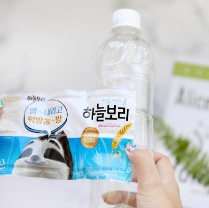
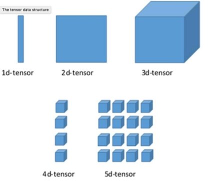
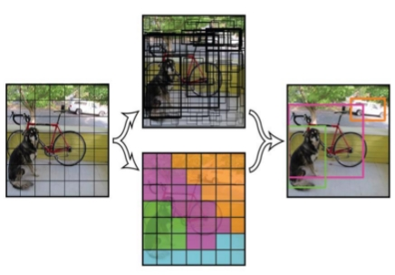
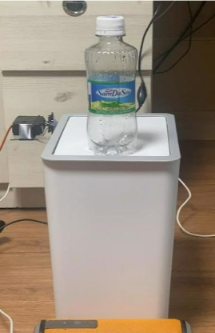
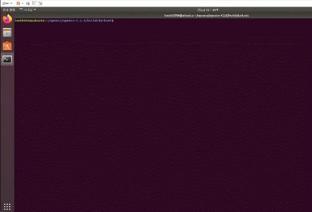
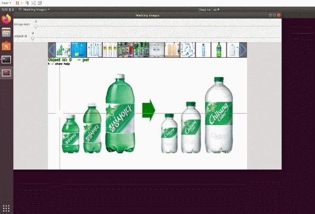
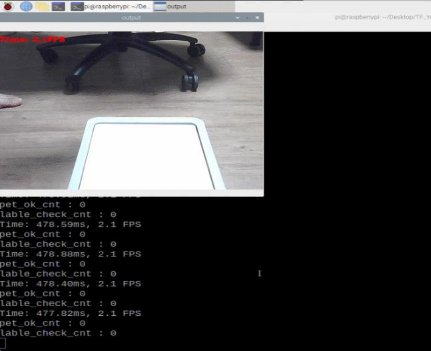
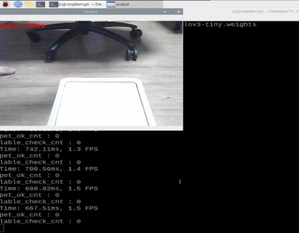

페트병 라벨지 유무 확인 분리수거 시스템

백석대학교 컴퓨터공학부 인재훈

01 프로젝트 설계 배경 및 목표

02 관련 기술 동향 분석 목차 03 프로젝트

프로젝트 요구사항 정의

프로젝트 시스템 정의

프로젝트 시스템 설계

프로젝트 실행

04 결과 및 발전 가능성

2 프로젝트 설계 배경 및 목표

환경을 위한 페트병 라벨 분리 배출 법안이 시행 되고 있지만 아직도 라벨을 비분리 하여 배출하는 가구가 많다.

1 프로젝트 설계 배경 및 목표

저전력으로도 사용가능한 라즈베리파이를 메인보드로 이용

1. 수거할 병의 종류 확인
1. 라벨 분리 확인하기
1. 수거가 가능한 페트병 배출하기

등의 서비스가 제공되느 라벨 확인 시스템이 필요함.

1 프로젝트 설계 배경 및 목표

1. 라즈베리파이를 메인 보드로 사용하여 외부 보드를 사용하지 않는 하나의 시스템을 만든다.
1. 웹캠을 카메라 모듈로 사용하여 페트병을 인식한다.
1. 이미지 딥러닝을 이용하여 페트병의 라벨지 유무를 판단한다.
1. 서보모터를 사용하여 분리된 페트병을 수거하도록 제어한다.
1. 모든 모듈은 파이썬으로 사용하여 제어한다.
1. 누구나 쉽게 사용할 수 있도록 한다.

2 관련 기술 동향 분석

이미지 딥러닝

- 페트병의 라벨지 유무를 웹캠으로 캡쳐하여 이미지를 분석하기
- 보드 성능에 맞는 가벼운 머신으로 YOLO 선택
- 개발 언어에 맞는 실제 러닝 프레임 워크로 TensorFlow 사용
- 이미지 라벨링 및 학습 오브젝트 파일을 만들기 쉬운 프레임 워크 로 Darknet 사용

3 관련 기술 동향 분석

YOLO는 객체 검출(Object Detection)으로

격자 그리드로 나누어 한번에 클래스를 판단하고 이를 통합해 최종 객체를 구분한다.

동영상도 거의 실시간으로 동작할 만큼 빠른 속도를 자랑한다.

YOLO의 알고리즘

5 프로젝트 요구사항 정의

01 사용자의 사용을 위하여 다음의 기능이 제공 되어야 함.

사용자의 시스템 사용을 위한 안내 음성 출력 음성 출력을 위한 스피커

02 정확한 분리를 위한 다음의 기능이 제공되어야 함

페트병을 구분할 수 있는 이미지 딥러닝

페트병의 라벨지 유무를 구분할 수 있는 이미지 딥러닝 페트병의 개수를 제한하여 인식률을 높힘

페트병을 인식할 이미지를 캡쳐할 웹캠

03 배출을 위한 다음의 기능이 제공 되어야 함

수거가 가능한 페트병 인지 시 뚜껑을 열리게 할 서보모터

03 프로젝트 요구사항 정의

01 가용성

시스템은 24시간 서비스 되어야 한다. 따라서 사용하지 않을 경우에는 저전력 상태인 대기 상태 이어야 한다. 02 신뢰도

각 종 하드웨어 고장 및 전원 공급이 중지되는 등의 이슈 발생 시 수동으로 작동할 수 있도록 되어야 한다. 03 성능

명령 처리 응답 (시스템을 이용하는 사용자에 대한 응답 속도는 2초 이내), 500장의 사진

04

시험 용이성

통합된 기능 단위로 시험 환경의 구축 및 실험 절차에 따른 시험 및 결과 판정이 가능하도록 설계 되어야 한다. 05 사용 용이성

처음 사용하는 사용자라도 안내 음성을 듣고 시스템을 사용할 수 있어야 한다.

03 프로젝트 시스템 정의

쓰레기

카메라 촬영

딥러닝

NO YES NO 

페트병 수거 라벨 유무 확인 페트병 확인 페트병X 알림

YES

라벨 제거 알림

01 페트병 구별 업무

\1. 시스템은 항상 대기상태로 있다. 2 사용방법을 음성으로 안내한다.

3. 쓰레기를 올려두면 웹캠으로 촬영을 한다.
3. 이미지 딥러닝을 통해 페트병을 구별한다.
- (웹캠 인식의 과정에서 5초 대기 후 다시 촬영)

02 페트병 라벨 유무 확인

1. 페트병에 라벨지가 없는 경우에 페트병을 수거.
1. 페트병에 라벨지가 있는 경우에 라벨 제거 음성 출력 후 수거하지 않는다.
- (웹캠 인식의 과정에서 5초안에 인식이 없으면 종료 ->절전모드)

03 프로젝트 시스템 설계

01 시스템의 범위

1. OpenCV, Yolo 환경 구축
- 페트병 샘플 이미지 저장 및 학습
- 페트병 라벨 샘플 이미지 저장 및 학습
2. 페트병 구분/ 페트병 라벨지 유무 출력 값에 따른 모터 제어 및 알림음 출력
2. 분리수거를 하면서 사용자가 쉽고, 정확한 방법으로 환경보호에도 도움이 될 수 있도록 관리

03 프로젝트 실행

구현 서비스

1. 페트병 종류 구분
1. 라벨지 유무 구분
1. 음성 안내 서비스
1. 페트병 수거 서비스

페트병 종류 구분 및 라벨지 유무 확인

`     `

이미지의 라벨링 및 학습의 편의를 위해 darknet 프레임 워크를 사용

라즈베리 os와 유사한 linux os를 이용하여 학습

페트병 종류 구분 및 라벨지 유무 확인

`       `

학습의 결과물 weight 파일을 이용하여 속도와 python으로 구성된

TensorFlow 프레임 워크로 객체 인식

4 프로젝트 실행

음성 안내 서비스와 수거 시스템

사용자의 편의를 위하여 라벨 인식이나, 수거 등의 서비스가 실행 될 때 스피커를 통하여 음성으로 안내

라벨이 떼어진 페트병을 수거하기 위한 서보 모터를 뚜껑부에 부착하여 제어

5 결과 및 발전 가능성

결과

처음 사용하는 사용자도 사용하기 쉽게 음성 안내를 활용. 사용법 안내를 위한 비용 절감 라벨지 분리를 위한 인력 감소 및 자원 낭비 방지

코드들의 모듈화로 이식 및 변경 용이

발전 가능성

이미지 딥 러닝을 통해 페트병/ 라벨지 유무 구분 뿐만 아니라

쓰레기들의 재활용 안내등, 어려운 분리 배출의 안내를 도와 더 많은 재활용 자원을 획득할 수 있음 저전력 사용으로 자원의 낭비를 방지할 수 있음

감사합니다
